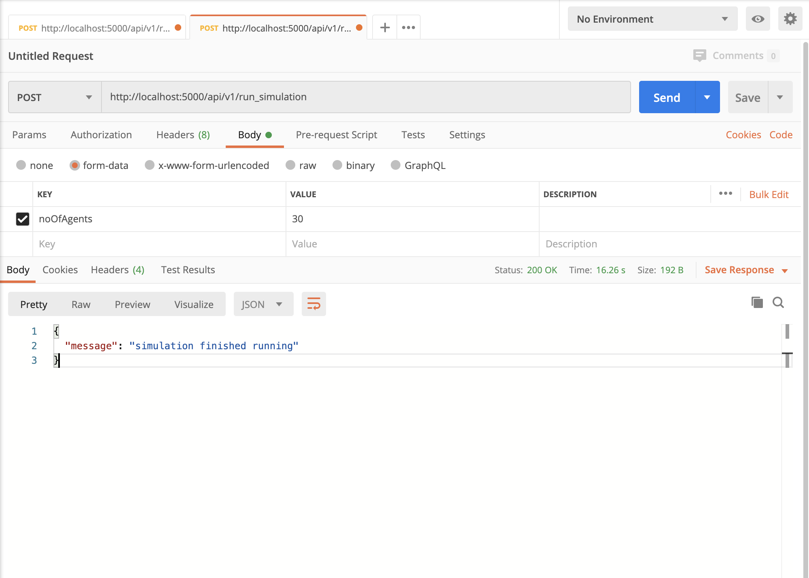

# EQ - call center simulation

Example flask app for running a simulation of a call center with x number of consumers and agents.


## Getting started
This app was deployed and tested on **Python 3.7**. Using older and newer versions of Python might cause some issues.

It is recommended that you create a Python virtual env before installing the dependencies to maintain isolation between environments and avoiding dependency clashing.

```shell
cd ..\
python3.7 -m venv py3.7
source py3.7/bin/activate
```

You should now see that the virtual environment has been activated with the prefix `virtualenv` name on your terminal.
```shell
(py3.7)Phats-iMac:EQ-callcenter phatnguyen$
```

Run this app locally:

```shell
pip install -r requirements.txt
python run.py
```

Download [Postman](https://www.postman.com/downloads/).
```
Create a POST request to http://localhost:5000/api/v1/run_simulation with a body including the two parameters:
- noOfCustomers
- noOfAgents
```


If you don't pass the parameters, the simulation will run with the default values of **1000** and **20** for the customers and agents respectively.

## Deploy to Kubernetes minikube

Install [docker desktop](https://www.docker.com/products/docker-desktop) and [kubernetes - minikube](https://kubernetes.io/docs/tasks/tools/install-minikube/) and run:

```shell
docker build -t everquote:1.0 .
kubectl apply -f resources.yaml
```
To access the service in the Kubernetes cluster, you need to forward a local port to a port on the Pod

```shell
# run this first to get the pod name
kubectl get pods -n everquote

# results should look something similar to this
NAME                          READY   STATUS    RESTARTS   AGE
callcenter-778fb94744-88qfr   1/1     Running   0          9s

kubectl port-forward podname localPort:podPort
# if you see this on the terminal, the service is now accessible and can be reached using Postman.
Forwarding from 127.0.0.1:5000 -> 5000
Forwarding from [::1]:5000 -> 5000
Handling connection for 5000
Handling connection for 5000
```

## Project Structure


Core files to run the program.

    ├── project
    │   ├── __init__.py
    │   ├── .env
    │   ├── .env.example
    │   ├── callcenter.py    
    │   └── dataModels.py

This file fires up the Flask server.


    ├── run.py

This file is responsile for Kubernetes deployment.

    ├── resources.yaml

All test-related files. 

    ├── tests
    │   └── fixtures
    │   │     ├── __init__.py
    │   │     ├── agent.py
    │   │     ├── callcenter.py
    │   │     └── customer.py
    │   ├── confest.py
    │   ├── test_callcenter.py
    │   └── test_data_models.py

Asset files: list of all 50 stats and images used for README.md

    ├── assets
    │   ├── listOf50States.txt
    │   └── postman.png

## Tests

NEED TO MENTION ABOUT THE CONFTEST SETUP

Standalone unit tests run with:

```shell
pip install pytest pytest-cov pytest-flask
pytest --cov=web/ --ignore=tests/integration tests
```


## Future Enhancements

- Improve the logic of the simulation by leveraging multi-threading to dynamically monitor each agent and return customer's voicemail once they are left.
- Employ StringIO and Response object from flask to allow download the xlsx report file on HTTP request instead of writing to the local directory.

